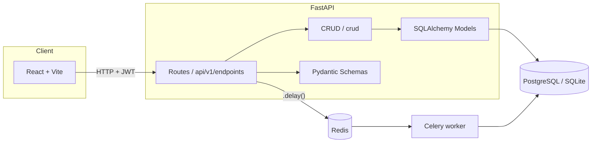
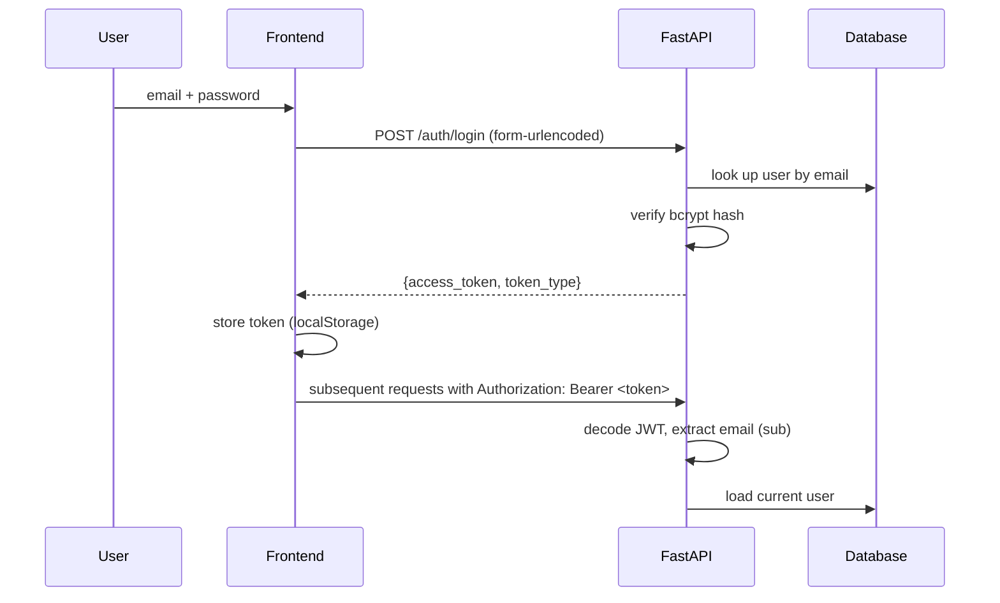

# Architecture — Task Manager API

Referenced from section 3 of [`PRESENTATION_SCRIPT.md`](./PRESENTATION_SCRIPT.md).
For setup instructions and the GenAI usage writeup, see the main
[`README.md`](../README.md).

## Component overview

## Authentication flow

## Why separate layers (api / crud / models / schemas)

The goal is for each layer to have a single responsibility and be testable in
isolation:

- **`api/v1/endpoints/`** — only knows about HTTP: status codes, query param
  parsing, authentication. Doesn't know how a task gets saved to the database.
- **`crud/`** — only knows about SQLAlchemy: queries, filtering, pagination.
  Doesn't know anything about HTTP (it never raises `HTTPException` — that's
  the route layer's job).
- **`schemas/`** — only knows about validation/serialization. Guarantees the
  API never accepts or returns fields it shouldn't (e.g. `hashed_password` is
  never serialized back to the client).
- **`models/`** — only knows the structure of persisted data.

This separation is the central argument for the "Clean Architecture" criterion
in the brief: each layer can swap implementations (a different database, a
different web framework) without forcing a rewrite of the others.

## Task permission rule

A task is only visible/editable by:
- whoever created it (`owner_id`), or
- whoever it's assigned to (`assignee_id`)

Implemented in `_get_owned_task` (`app/api/v1/endpoints/tasks.py`), called by
every endpoint that operates on a specific task (`GET`, `PATCH`, `DELETE`,
`POST /complete`). Returns `404` if the task doesn't exist, `403` if it exists
but the current user has no relationship to it.

## Pagination and filtering

`GET /tasks/` accepts `page`, `page_size`, `status`, `due_date`, `due_before`,
`due_after`. The total count (`total`) is computed with `func.count()` over
the same filtered query, before `offset`/`limit` are applied — this guarantees
`total` reflects the applied filters, not the overall number of tasks in the
database.

## Background job (Celery)

Marking a task as `done` (via `PATCH` with `status=done`, or via
`POST /tasks/{id}/complete`) makes the endpoint call
`notify_task_completed.delay(...)`. That call sits inside a `try/except` — if
the Redis broker is unreachable, the exception is swallowed and the HTTP
request still completes normally. This was a deliberate decision: the
notification is a nice-to-have side effect, but it shouldn't be able to bring
down the main operation (marking the task complete).
